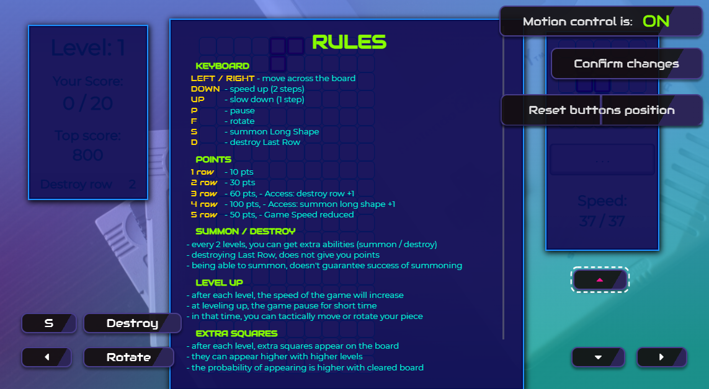
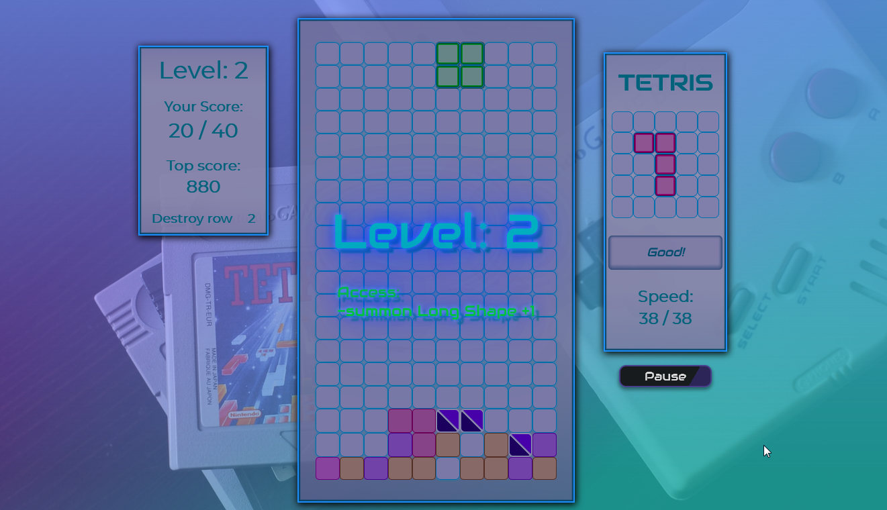

# [Tetris](https://michal-w-dev.github.io/Tetris/)

## About the App

Game in Tetris with unique rules and figures.\
On mobile player can choose where control buttons are placed (or use 2 default locations) and use motion control to control the game. 
Buttons location and results of the game are saved in local storage.

## Images

#

#

#